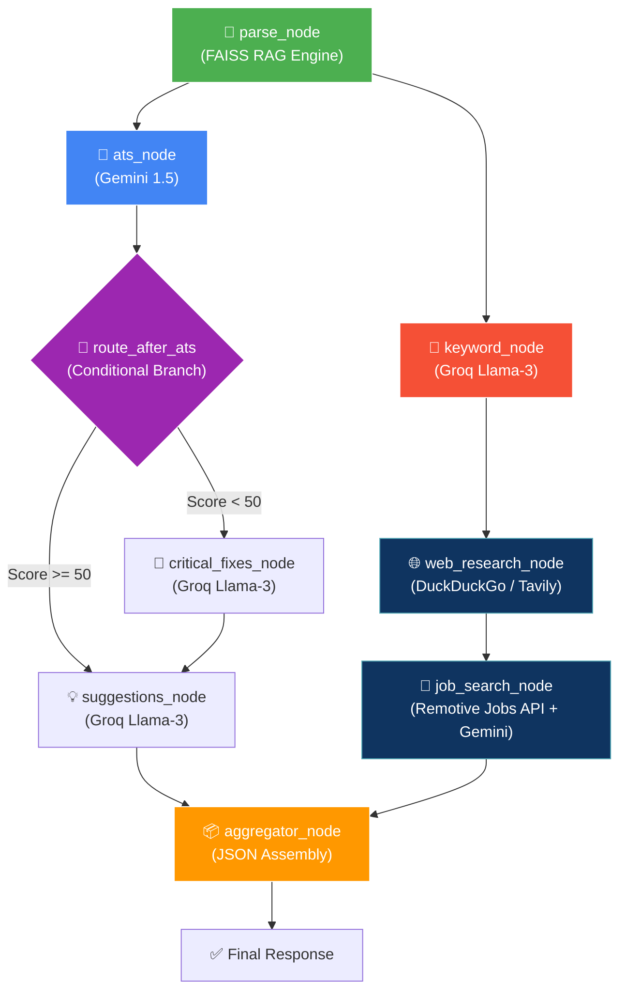

# 🚀 NextGen Resume Scanner (v2.0)


An advanced, multi-agent AI resume analyzer built with **LangGraph**. Unlike standard resume parsers that rely on a single LLM call, this project uses a highly orchestrated **Agentic Workflow** that combines local RAG, live web research, and dual-LLM processing (Google Gemini + Meta Llama 3 via Groq) to provide deep, actionable career insights.

---

## 🧠 The Agentic Architecture

This project abandons the traditional "one massive prompt" approach. Instead, it utilizes **LangGraph** to route the resume through 5 specialized AI Agents running in parallel branches.

### The Pipeline Flow:
1. **📄 Parser Node (RAG)**: Uses local HuggingFace embeddings (`all-MiniLM-L6-v2`) to chunk the resume and build a vector database, extracting only the relevant sections (like "Skills" or "Experience") for specific agents.
2. **⚖️ Conditional Routing**:
   - The **ATS Agent** grades the resume (0-100).
   - *If Score < 50*: Routes to a **Critical Fixes Agent** to salvage the resume.
   - *If Score >= 50*: Proceeds to the Parallel Analysis block.
3. **⚡ Parallel Analysis (Hybrid LLM)**:
   - **Keyword Agent (Groq)**: Extracts technical/soft skills from the RAG context.
   - **Suggestions Agent (Groq)**: Generates highly specific, actionable bullet-point improvements.
   - **Web Research Agent (Groq)**: Uses DuckDuckGo and Tavily to search the live internet for trending skills and current salary ranges for the candidate's detected role.
   - **Job Search Agent (Gemini)**: Connects to the Remotive API to fetch 5 real, currently active remote jobs and evaluates if the candidate is a match.
4. **✅ Aggregator Node**: Waits for all parallel agents to finish and combines their structured JSON outputs into a single comprehensive dashboard payload.

### Pipeline Execution Flow


---

## 🏗️ Why a Hybrid LLM Approach?

Calling a heavy LLM 5 times per resume is expensive and hits rate limits instantly. This project solves that by routing tasks intelligently:
* **Heavy Reasoning (Google Gemini 1.5 Flash)**: Used for deep reading and complex matching (ATS Evaluation, Job Matching).
* **High-Speed Extraction (Groq - Llama 3)**: Used for lightning-fast keyword extraction and summarization.

This drops the API load drastically, making the system highly scalable and fast!

---

## 🛠️ Tech Stack
* **Frontend**: Pure HTML, CSS (Glassmorphism & Light Theme), Vanilla JS (No frameworks needed)
* **Backend Framework**: FastAPI + Uvicorn
* **AI Orchestration**: LangGraph + LangChain
* **Embeddings / RAG**: HuggingFace (`sentence-transformers`), FAISS
* **LLMs**: Google Gemini 1.5 Flash, Groq (Llama-3.1-8b-instant / Compound-Mini)
* **Live Tools**: DuckDuckGo Search, Tavily Search API, Remotive Jobs API

---

## ✨ Features (v2.0)
* **Pristine Light Theme UI**: A beautiful, responsive frontend styled similarly to premium products like Enhancv, featuring glassmorphism and subtle gradient meshes.
* **Smart Dashboard**: Visualizes your ATS score, extracted keywords, missing skills, and live market data.
* **Job Matcher**: Compare your resume against a pasted job description to see compatibility.
* **Cover Letter Writer**: Generates a highly tailored 3-paragraph cover letter based on your resume and target role.
* **Interview Prep**: Generates Technical, Behavioral, and Situational questions derived from the specific experiences listed in your resume.

---

## 🚀 How to Run Locally

### 1. Clone the repository
```bash
git clone https://github.com/mahaveer0738/NextGen-Resume-Scanner.git
cd NextGen-Resume-Scanner/backend
```

### 2. Create a Virtual Environment & Install Dependencies
```bash
python -m venv venv
# Windows:
.\venv\Scripts\activate
# Mac/Linux:
source venv/bin/activate

pip install -r requirements.txt
```

### 3. Configure Environment Variables
Create a `.env` file in the `backend/` directory and add your free API keys:
```env
GOOGLE_API_KEY=your_gemini_key_here
GROQ_API_KEY=your_groq_key_here
TAVILY_API_KEY=your_tavily_key_here  # Optional
```

### 4. Run the Backend Server
```bash
# Still in the backend/ directory
python -m uvicorn main:app --port 8000
```
Visit `http://localhost:8000/docs` to test the API directly via Swagger UI.

### 5. Open the Frontend
The frontend requires NO build steps! Simply:
1. Open your File Explorer.
2. Navigate to `NextGen-Resume-Scanner/frontend/`.
3. Double-click `index.html` to open it in your browser.
4. Upload a resume and watch the AI work!

---
*Built to revolutionize how resumes are analyzed by utilizing true Agentic AI workflows.*
