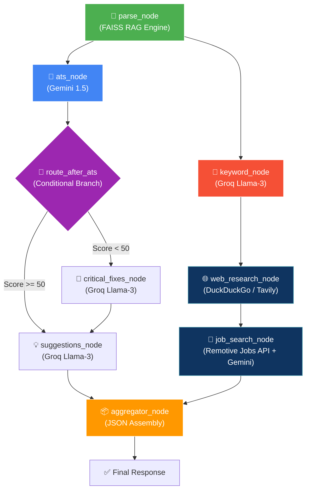

# 🚀 NextGen Resume Scanner (v2.0)

<div align="center">
  
  
  
  
  
</div>

<br/>

An advanced, multi-agent AI resume analyzer built with **LangGraph**. Unlike standard resume parsers that rely on a single LLM call, this project uses a highly orchestrated **Agentic Workflow** that combines local RAG, live web research, and dual-LLM processing (Google Gemini + Meta Llama 3 via Groq) to provide deep, actionable career insights.

---

## 🎥 Demos & Video Showcases

Explore our video demonstrations showing the powerful capabilities of the NextGen Resume Scanner in action:

- [🎬 Light Theme: Analysis & Home Page Walkthrough](Demo_Videos/Light_theme_Analyse_Page_Home_Page.mp4)
- [🎬 Dark Theme: Resume Analysis Demo](Demo_Videos/Resume_Analyse_Page_Dark_Theme.mp4)

*(Note: Click the links above to download or view the videos directly in your browser on GitHub)*

---

## 🆕 Recent Updates (v2.1 Frontend Polish)

- **Fully Wired Frontend**: All tools including the *Cover Letter Generator*, *Job Match Analyzer*, and *Interview Prep* are now 100% connected to the backend LangGraph agents.
- **UI Bug Fixes**: Fixed broken scroll targets and removed placeholder "coming soon" alerts.
- **Homepage Integration**: Added the Cover Letter Generator directly to the homepage feature grid and linked the ATS deep-dive features directly to the analysis upload flow.

---

## ✨ Non-Technical Features (What it does for you)

If you are a job seeker, this platform is your ultimate AI career coach. Here is how it helps you land your dream job:

- **📈 Instant ATS Parsing Score**: Upload your resume and instantly see how Applicant Tracking Systems (ATS) read your document. Find out your score out of 100.
- **🎯 Smart Job Matcher**: Compare your current resume with any job description you paste. Get a compatibility score and know exactly what you are missing.
- **💡 Actionable Improvements**: Get pinpoint AI suggestions to improve specific bullet points. No more vague advice—just direct fixes to boost your callback rate.
- **💼 Real Active Job Recommendations**: Don't just get analyzed, get hired! The system automatically fetches 5 real, currently active remote jobs that match your skills.
- **💰 Live Market Salary Data**: Discover your worth with live estimated salary ranges for your role, sourced directly from live internet searches.
- **🎤 AI Interview Prep**: Automatically generate tailored technical, behavioral, and situational interview questions based on the exact experience listed in your resume.
- **✉️ Auto Cover Letter Generation**: Generate a highly tailored, professional 3-paragraph cover letter targeting your specific role and based on your actual resume data.
- **🎨 Stunning Light & Dark UI**: Enjoy a premium, glassmorphism-inspired interface with seamless animations and real-time scanning feedback.

---

## ⚙️ Technical Features (Under the hood)

Built for developers, this project showcases modern Agentic workflows, RAG, and efficient LLM orchestration.

- **🤖 LangGraph Agentic Architecture**: Abandons the traditional "one massive prompt" approach. Routes the resume through 5 specialized AI Agents running in parallel branches.
- **🧠 Local FAISS RAG Engine**: Uses local HuggingFace embeddings (`all-MiniLM-L6-v2`) to chunk the resume and build an in-memory vector database. Extacts only relevant context without blowing up token limits.
- **⚡ Hybrid LLM Execution**:
  - **Heavy Reasoning**: Uses **Google Gemini 1.5 Flash** for deep reading and complex matching (ATS Evaluation, Job Matching).
  - **High-Speed Extraction**: Uses **Groq (Meta Llama 3)** for lightning-fast keyword extraction and summarization.
- **🕸️ Live Web Research**: The Web Research Agent dynamically hits the internet using DuckDuckGo and Tavily to find trending skills and accurate salary data.
- **💼 External API Integration**: Connects to the **Remotive Jobs API** to pull live, active remote job listings.
- **🚀 Ultra-Fast FastAPI Backend**: Async Python endpoints to orchestrate the LangGraph workflow concurrently.
- **💻 Zero-Build Frontend**: Pure HTML/CSS/Vanilla JS frontend means absolutely no build steps, node_modules, or npm headaches. Just double click `index.html`.

---

## 🧠 The Agentic Architecture Pipeline

### The Pipeline Flow:
1. **📄 Parser Node (RAG)**: Uses local HuggingFace embeddings to chunk the resume and build a vector database, extracting only the relevant sections (like "Skills" or "Experience") for specific agents.
2. **⚖️ Conditional Routing**:
   - The **ATS Agent** grades the resume (0-100).
   - *If Score < 50*: Routes to a **Critical Fixes Agent** to salvage the resume.
   - *If Score >= 50*: Proceeds to the Parallel Analysis block.
3. **⚡ Parallel Analysis (Hybrid LLM)**:
   - **Keyword Agent (Groq)**: Extracts technical/soft skills from the RAG context.
   - **Suggestions Agent (Groq)**: Generates highly specific, actionable bullet-point improvements.
   - **Web Research Agent (Groq)**: Uses DuckDuckGo and Tavily to search the live internet for trending skills and current salary ranges.
   - **Job Search Agent (Gemini)**: Connects to the Remotive API to fetch remote jobs and evaluates if the candidate is a match.
4. **✅ Aggregator Node**: Waits for all parallel agents to finish and combines their structured JSON outputs into a single comprehensive dashboard payload.

### Pipeline Execution Diagram


---

## 🛠️ Tech Stack

* **Frontend**: Pure HTML, CSS (Glassmorphism & Light/Dark Themes), Vanilla JS
* **Backend Framework**: FastAPI + Uvicorn + Python 3.12
* **AI Orchestration**: LangGraph + LangChain
* **Embeddings / RAG**: HuggingFace (`sentence-transformers`), FAISS
* **Large Language Models**: Google Gemini 1.5 Flash, Groq (Llama-3.1-8b-instant / Compound-Mini)
* **Live Tools**: DuckDuckGo Search, Tavily Search API, Remotive Jobs API

---

## 🚀 How to Run Locally

### 1. Clone the repository
```bash
git clone https://github.com/mahaveer0738/NextGen-Resume-Scanner.git
cd NextGen-Resume-Scanner/backend
```

### 2. Create a Virtual Environment & Install Dependencies
```bash
python -m venv venv

# Windows:
.\venv\Scripts\activate
# Mac/Linux:
source venv/bin/activate

pip install -r requirements.txt
```

### 3. Configure Environment Variables
Create a `.env` file in the `backend/` directory and add your free API keys:
```env
GOOGLE_API_KEY=your_gemini_key_here
GROQ_API_KEY=your_groq_key_here
TAVILY_API_KEY=your_tavily_key_here  # Optional
```

### 4. Run the Backend Server
```bash
# Ensure you are in the backend/ directory
python -m uvicorn main:app --port 8000
```
Visit `http://localhost:8000/docs` to test the API directly via Swagger UI.

### 5. Open the Frontend
The frontend requires NO build steps! Simply:
1. Open your File Explorer.
2. Navigate to `NextGen-Resume-Scanner/frontend/`.
3. Double-click `index.html` to open it in your browser.
4. Upload a resume and watch the AI Agents work!

---
*Built to revolutionize how resumes are analyzed by utilizing true Agentic AI workflows.*
