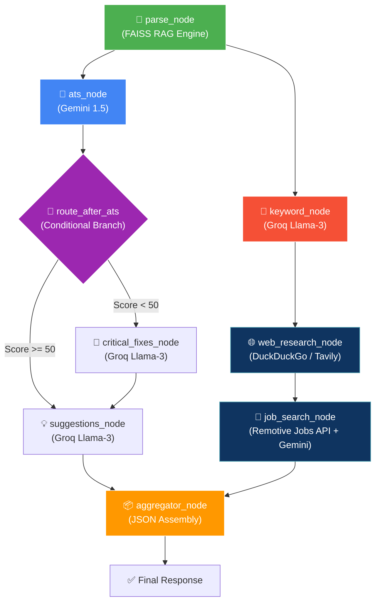

# 🚀 Implementation Plan: ResumeAI v2.0 Architecture

This document serves as the official blueprint for the **NextGen Resume Scanner (v2.0)**. It outlines the hybrid AI architecture, the parallel Agentic workflow, and the prebuilt tools utilized in the project.

---

## 🧠 Core Architecture: Hybrid LLM Strategy

To maximize performance, reduce costs, and avoid rate limits, the system utilizes a dual-LLM approach:

1. **Google Gemini (1.5 Flash)**
   - **Role**: Heavy Reasoning & Complex Matching
   - **Agents**: ATS Evaluation Agent, Job Matching Agent
   - **Why**: Gemini has a massive context window and excelling at comparing two large bodies of text (like a resume against a job description).

2. **Groq (Llama-3 Compound-Mini / 8b-instant)**
   - **Role**: High-Speed Extraction & Generation
   - **Agents**: Keyword Extraction, Suggestion Generation, Web Research
   - **Why**: Groq's LPU architecture provides literal instant responses (upwards of 800 tokens/second), making it perfect for rapid data extraction.

---

## ⚡ The LangGraph Pipeline

The system abandons linear execution in favor of a highly orchestrated **Directed Acyclic Graph (DAG)** using `LangGraph`.

### Pipeline Execution Flow


---

## 🛠️ Integrated Tools & APIs

Instead of relying solely on the LLM's internal knowledge, the agents use live external tools:

1. **FAISS Vector Database (Local RAG)**
   - Used by the Parser Node to chunk the resume into embeddings. 
   - Agents query this database to extract specific sections (e.g., "skills") rather than reading the entire document.
2. **DuckDuckGo & Tavily Search APIs**
   - Used by the Web Research Agent to pull live salary ranges and trending skills for the candidate's industry.
3. **Remotive Remote Jobs API (Free)**
   - Used by the Job Search Agent to pull real, currently active remote jobs. Gemini then compares the resume against these jobs to determine compatibility.

---

## 📁 File Structure

```text
backend/
├── agents/
│   ├── ats_agent.py              # Gemini 1.5 Flash
│   ├── keyword_agent.py          # Groq Llama 3 (RAG Enabled)
│   ├── suggestions_agent.py      # Groq Llama 3
│   ├── web_research_agent.py     # DuckDuckGo + Groq Llama 3
│   ├── job_search_agent.py       # Remotive API + Gemini 1.5 Flash
│   └── critical_fixes_agent.py   # Groq Llama 3
├── graph/
│   └── resume_graph.py           # LangGraph Orchestration (Parallel + Conditional)
├── utils/
│   └── rag_engine.py             # FAISS + HuggingFace Embeddings
├── config.py                     # API Keys & Model Management
└── routes/
    └── analyze.py                # Main FastAPI Endpoint
```

---

## ✅ Implementation Status
* [x] **RAG Implementation**: Completed using HuggingFace `all-MiniLM-L6-v2`.
* [x] **Web Search Integration**: Completed using DuckDuckGo + Tavily.
* [x] **Live Job Integration**: Completed using Remotive Jobs API.
* [x] **LangGraph Orchestration**: Completed with Parallel & Conditional routing.
* [x] **Hybrid LLM Setup**: Completed. Tested and verified on Groq and Gemini.
* [x] **Frontend Dashboard (Phase 3)**: Completed. Implemented Enhancv-style Light Theme with Glassmorphism, CSS Grid Bento Box layout, and micro-animations.
* [x] **Standalone Tools (Phase 3)**: Completed. Built and wired up Job Matcher, Cover Letter Generator, and Interview Prep pages to the FastAPI backend.
