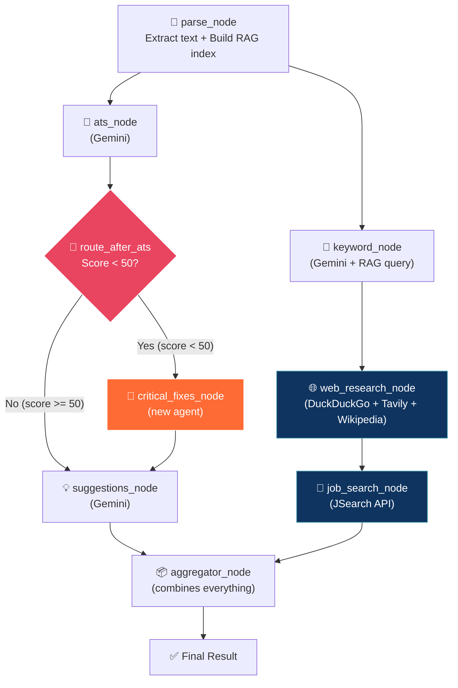

# 🚀 ResumeAI v2.0 — Enhanced Architecture with RAG, Tools & Smart Graph

## Overview

Transform the current linear LangGraph pipeline into a **production-grade, intelligent multi-agent system** with:
- **RAG (Retrieval Augmented Generation)** for smart resume section querying
- **Prebuilt tools** (DuckDuckGo, Tavily, Wikipedia) for real-world data
- **JSearch API** for real job listings
- **LinkedIn/ProxyCurl** integration (optional, needs paid API key)
- **Conditional branching** (if ATS score < 50 → run critical fixes agent)
- **Parallel execution** (ATS + Keywords run simultaneously)
- **New agents**: Web Research Agent, Job Search Agent, Critical Fixes Agent

---

## User Review Required

> [!IMPORTANT]
> **API Keys Needed**: Some tools require API keys. Here's the breakdown:
> 
> | Tool | API Key? | Cost | How to Get |
> |------|----------|------|------------|
> | DuckDuckGo Search | ❌ No key needed | Free forever | Just install |
> | Wikipedia | ❌ No key needed | Free forever | Just install |
> | Tavily Search | ✅ Yes | Free tier: 1000 searches/month | [tavily.com](https://tavily.com) |
> | JSearch (RapidAPI) | ✅ Yes | Free tier: 200 requests/month | [rapidapi.com/letscrape-6bRBa3QguO5/api/jsearch](https://rapidapi.com/letscrape-6bRBa3QguO5/api/jsearch) |
> | ProxyCurl (LinkedIn) | ✅ Yes | $0.01/request (10 free credits) | [nubela.co/proxycurl](https://nubela.co/proxycurl) |
> | Google Embeddings | ✅ Uses existing key | Free with Gemini API | Already have it ✅ |
> | FAISS Vector Store | ❌ No key needed | Free, runs locally | Just install |

> [!WARNING]
> **ProxyCurl (LinkedIn)** is a paid service. I'll implement it as an **optional feature** — the app works perfectly without it. You can enable it later when you want.

## Open Questions

> [!IMPORTANT]
> 1. **Tavily API key** — Do you already have one, or should I set up DuckDuckGo as the primary search and Tavily as optional?
> 2. **JSearch API key** — Do you have a RapidAPI account? The free tier gives 200 requests/month which is enough for development.
> 3. **ProxyCurl** — Should I implement this now (needs paid API key) or stub it out for later?
> 4. **Frontend updates** — The current frontend will need new sections to display job listings, trending skills, etc. Should I update the frontend too, or just the backend for now?

---

## Current vs. New Architecture

### Current (Linear Pipeline)
```
START → [ATS] → [Keywords] → [Suggestions] → [Aggregator] → END
```

### New (Smart Parallel Pipeline with RAG + Tools)


---

## Proposed Changes

### Component 1: New Dependencies

#### [MODIFY] [requirements.txt](file:///c:/Users/91960/Desktop/files/Rishu_Project/backend/requirements.txt)

Add these new packages:

```diff
 # ── AI / LLM FRAMEWORK ─────────────────────────────────────
 langchain>=0.2.6
 langchain-google-genai>=1.0.6
 langgraph>=0.1.19
+langchain-community>=0.2.6        # Prebuilt tools (search, wiki, etc.)

+# ── RAG (Retrieval Augmented Generation) ────────────────────
+faiss-cpu>=1.8.0                   # Vector store (runs locally, no API needed)
+langchain-text-splitters>=0.2.0    # Smart text chunking for RAG

+# ── SEARCH & WEB TOOLS ──────────────────────────────────────
+duckduckgo-search>=6.1.0           # Free web search (no API key!)
+tavily-python>=0.3.0               # AI-optimized search (free tier: 1000/month)
+wikipedia>=1.4.0                   # Free knowledge lookup

+# ── JOB SEARCH API ──────────────────────────────────────────
+requests>=2.31.0                   # HTTP client for JSearch API
```

---

### Component 2: Configuration Updates

#### [MODIFY] [config.py](file:///c:/Users/91960/Desktop/files/Rishu_Project/backend/config.py)

Add new API key configs and RAG settings:

```python
# ── SEARCH API KEYS ────────────────────────────────────────
TAVILY_API_KEY    = os.getenv("TAVILY_API_KEY", "")
JSEARCH_API_KEY   = os.getenv("JSEARCH_API_KEY", "")      # RapidAPI key
PROXYCURL_API_KEY = os.getenv("PROXYCURL_API_KEY", "")     # LinkedIn (optional)

# ── RAG SETTINGS ───────────────────────────────────────────
RAG_CHUNK_SIZE    = 500    # Characters per chunk
RAG_CHUNK_OVERLAP = 100    # Overlap between chunks for context continuity
ATS_CRITICAL_THRESHOLD = 50  # Score below this triggers critical fixes agent
```

#### [MODIFY] [.env](file:///c:/Users/91960/Desktop/files/Rishu_Project/backend/.env)

Add new API key placeholders:

```
TAVILY_API_KEY=your-tavily-key-here
JSEARCH_API_KEY=your-rapidapi-key-here
PROXYCURL_API_KEY=your-proxycurl-key-here
```

---

### Component 3: RAG Engine (NEW — The Core of RAG Revision)

#### [NEW] [rag_engine.py](file:///c:/Users/91960/Desktop/files/Rishu_Project/backend/utils/rag_engine.py)

This is where your RAG knowledge gets applied! The file will:

1. **Load** resume text using LangChain `Document` objects
2. **Split** into smart chunks using `RecursiveCharacterTextSplitter` (the most important splitter — it tries to keep sentences/paragraphs together)
3. **Embed** chunks using Google's embedding model (`models/embedding-001`)
4. **Store** in FAISS vector store (runs 100% locally, no external service)
5. **Query** — any agent can ask "what does the resume say about work experience?" and get the most relevant chunks

```python
# Conceptual structure:
class ResumeRAGEngine:
    def __init__(self, resume_text: str):
        # 1. Create Document objects (LangChain way)
        # 2. Split into chunks
        # 3. Generate embeddings
        # 4. Store in FAISS

    def query(self, question: str, k: int = 3) -> str:
        # Semantic search: find the k most relevant chunks
        # Returns combined text of matching chunks
    
    def get_section(self, section_name: str) -> str:
        # Query for specific sections: "skills", "experience", "education"
```

**How RAG connects to your existing knowledge:**
```
Without RAG (current):
  Agent receives ENTIRE resume text (could be 3000+ chars)
  → LLM processes everything even if it only needs the skills section
  → Wastes tokens, slower, less focused

With RAG (new):
  Agent asks: "What are the candidate's technical skills?"
  → FAISS finds the 2-3 most relevant chunks
  → LLM only processes ~500 chars of highly relevant text
  → Faster, cheaper, more accurate answers
```

---

### Component 4: Prebuilt Tools Module (NEW)

#### [NEW] [tools.py](file:///c:/Users/91960/Desktop/files/Rishu_Project/backend/utils/tools.py)

Central registry of all prebuilt tools:

```python
# 1. DuckDuckGo — free web search
def get_duckduckgo_tool():
    from langchain_community.tools import DuckDuckGoSearchResults
    return DuckDuckGoSearchResults(max_results=5)

# 2. Tavily — AI-optimized search (if key available)
def get_tavily_tool():
    from langchain_community.tools.tavily_search import TavilySearchResults
    return TavilySearchResults(max_results=5)

# 3. Wikipedia — knowledge lookup
def get_wikipedia_tool():
    from langchain_community.tools import WikipediaQueryRun
    return WikipediaQueryRun(...)

# 4. JSearch — real job listings
@tool
def search_real_jobs(query: str, location: str = "India") -> str:
    """Search for real job listings using JSearch API"""
    # Calls RapidAPI's JSearch endpoint
    ...

# 5. LinkedIn (optional)
@tool
def get_linkedin_profile(linkedin_url: str) -> str:
    """Fetch LinkedIn profile data using ProxyCurl"""
    ...
```

---

### Component 5: New Agent — Web Research Agent

#### [NEW] [web_research_agent.py](file:///c:/Users/91960/Desktop/files/Rishu_Project/backend/agents/web_research_agent.py)

Uses DuckDuckGo + Tavily + Wikipedia to:
- Search trending skills for the detected role
- Find average salary data
- Look up industry knowledge

```python
def run_web_research_agent(detected_role: str, found_keywords: list) -> dict:
    """
    Researches the web for:
    1. Trending skills for the detected role
    2. Average salary range
    3. Industry insights from Wikipedia
    
    Returns: dict with trending_skills, salary_range, industry_insights
    """
```

---

### Component 6: New Agent — Job Search Agent

#### [NEW] [job_search_agent.py](file:///c:/Users/91960/Desktop/files/Rishu_Project/backend/agents/job_search_agent.py)

Uses JSearch API to find REAL matching jobs:

```python
def run_job_search_agent(detected_role: str, keywords: list) -> dict:
    """
    Finds real job listings matching the resume profile.
    
    Returns: dict with job_listings: [{title, company, location, url, salary}, ...]
    """
```

---

### Component 7: New Agent — Critical Fixes Agent

#### [NEW] [critical_fixes_agent.py](file:///c:/Users/91960/Desktop/files/Rishu_Project/backend/agents/critical_fixes_agent.py)

Only runs when ATS score < 50. Uses RAG to identify the weakest sections:

```python
def run_critical_fixes_agent(resume_text: str, ats_result: dict, rag_engine) -> dict:
    """
    Generates CRITICAL fix recommendations for low-scoring resumes.
    Uses RAG to identify the weakest sections and give targeted fixes.
    
    Returns: dict with critical_fixes: [{section, issue, fix, priority}, ...]
    """
```

---

### Component 8: Enhanced Graph (THE BIG CHANGE)

#### [MODIFY] [resume_graph.py](file:///c:/Users/91960/Desktop/files/Rishu_Project/backend/graph/resume_graph.py)

Major rewrite with:

**New State:**
```python
class ResumeState(TypedDict):
    # Input
    resume_text: str
    
    # RAG (NEW)
    rag_context: Optional[dict]           # Stores RAG engine reference data
    
    # Agent Results (existing + new)
    ats_result:           Optional[dict]
    keyword_result:       Optional[dict]
    suggestions_result:   Optional[dict]
    critical_fixes_result: Optional[dict]  # NEW — only filled if score < 50
    web_research_result:  Optional[dict]   # NEW — trending skills, salary
    job_search_result:    Optional[dict]   # NEW — real job listings
    
    # Final
    final_result:         Optional[dict]
```

**New Graph Structure:**
```python
def build_resume_graph():
    builder = StateGraph(ResumeState)
    
    # ── Add all nodes ──
    builder.add_node("parse_node",          parse_node)        # RAG indexing
    builder.add_node("ats_node",            ats_node)          # Existing
    builder.add_node("keyword_node",        keyword_node)      # Existing (enhanced with RAG)
    builder.add_node("critical_fixes_node", critical_fixes_node)  # NEW
    builder.add_node("suggestions_node",    suggestions_node)  # Existing
    builder.add_node("web_research_node",   web_research_node) # NEW
    builder.add_node("job_search_node",     job_search_node)   # NEW
    builder.add_node("aggregator_node",     aggregator_node)   # Enhanced
    
    # ── Entry point ──
    builder.set_entry_point("parse_node")
    
    # ── Parallel fan-out from parse ──
    builder.add_edge("parse_node", "ats_node")      # Both start
    builder.add_edge("parse_node", "keyword_node")   # simultaneously!
    
    # ── Conditional branching after ATS ──
    builder.add_conditional_edges("ats_node", route_after_ats, {
        "critical_fixes_node": "critical_fixes_node",
        "suggestions_node":    "suggestions_node"
    })
    builder.add_edge("critical_fixes_node", "suggestions_node")
    
    # ── Keyword → Web Research → Job Search ──
    builder.add_edge("keyword_node",     "web_research_node")
    builder.add_edge("web_research_node", "job_search_node")
    
    # ── Both branches converge at aggregator ──
    builder.add_edge("suggestions_node", "aggregator_node")
    builder.add_edge("job_search_node",  "aggregator_node")
    
    builder.add_edge("aggregator_node", END)
    
    return builder.compile()
```

**Conditional Router:**
```python
def route_after_ats(state: ResumeState) -> str:
    score = state.get("ats_result", {}).get("overall_score", 50)
    if score < 50:
        return "critical_fixes_node"   # Low score → get critical fixes first
    return "suggestions_node"          # Good score → skip to suggestions
```

---

### Component 9: Enhanced Existing Agents

#### [MODIFY] [keyword_agent.py](file:///c:/Users/91960/Desktop/files/Rishu_Project/backend/agents/keyword_agent.py)

Enhance to use RAG for focused skills extraction (query only the "skills" and "experience" sections instead of entire resume).

#### [MODIFY] [suggestions_agent.py](file:///c:/Users/91960/Desktop/files/Rishu_Project/backend/agents/suggestions_agent.py)

Enhance to incorporate web research data (trending skills) into suggestions.

---

### Component 10: Updated Route

#### [MODIFY] [analyze.py](file:///c:/Users/91960/Desktop/files/Rishu_Project/backend/routes/analyze.py)

Update to pass the new enhanced results (job listings, trending skills, critical fixes) to the frontend.

---

## New File Structure After Changes

```
backend/
├── agents/
│   ├── __init__.py
│   ├── ats_agent.py              # ← existing (minor updates)
│   ├── keyword_agent.py          # ← existing (enhanced with RAG)
│   ├── suggestions_agent.py      # ← existing (enhanced with web data)
│   ├── cover_letter_agent.py     # ← existing (untouched)
│   ├── interview_agent.py        # ← existing (untouched)
│   ├── job_match_agent.py        # ← existing (untouched)
│   ├── web_research_agent.py     # ← NEW ✨
│   ├── job_search_agent.py       # ← NEW ✨
│   └── critical_fixes_agent.py   # ← NEW ✨
├── graph/
│   ├── __init__.py
│   └── resume_graph.py           # ← MAJOR rewrite (parallel + conditional)
├── utils/
│   ├── __init__.py
│   ├── helpers.py                # ← existing (untouched)
│   ├── rag_engine.py             # ← NEW ✨ (RAG core)
│   └── tools.py                  # ← NEW ✨ (prebuilt tools registry)
├── routes/
│   ├── analyze.py                # ← updated response shape
│   └── ...                       # ← others untouched
├── config.py                     # ← new API key configs + RAG settings
├── requirements.txt              # ← new dependencies
├── .env                          # ← new API key placeholders
└── main.py                       # ← untouched
```

---

## Verification Plan

### Automated Tests

```bash
# 1. Install all new dependencies
pip install -r requirements.txt

# 2. Test RAG engine in isolation
python -c "from utils.rag_engine import ResumeRAGEngine; print('RAG OK')"

# 3. Test each tool individually
python -c "from utils.tools import get_duckduckgo_tool; t = get_duckduckgo_tool(); print(t.invoke('Python developer skills'))"

# 4. Test the full pipeline
python -c "from graph.resume_graph import run_resume_analysis; print('Graph compiles OK')"

# 5. Start server and test endpoint
uvicorn main:app --reload --port 8000
# Then POST to /api/analyze with a resume file
```

### Manual Verification

1. Upload a **strong resume** (ATS score > 50) → verify it skips `critical_fixes_node`
2. Upload a **weak resume** (ATS score < 50) → verify it runs `critical_fixes_node`
3. Check that **job listings** in the response are real (from JSearch)
4. Check that **trending skills** come from web search, not hallucinated
5. Verify **RAG queries** return focused sections (not the whole resume)
6. Test with both PDF and DOCX files
7. Verify the **parallel execution** — ATS and Keyword nodes should start simultaneously (check console logs for timing)

---

## Implementation Order

I'll build these in dependency order:

| Phase | What | Files | Why This Order |
|-------|------|-------|----------------|
| 1 | Dependencies + Config | `requirements.txt`, `config.py`, `.env` | Everything else depends on these |
| 2 | RAG Engine | `utils/rag_engine.py` | Core infrastructure for enhanced agents |
| 3 | Prebuilt Tools | `utils/tools.py` | Tools used by new agents |
| 4 | New Agents | `web_research_agent.py`, `job_search_agent.py`, `critical_fixes_agent.py` | Need tools + RAG first |
| 5 | Enhanced Existing Agents | `keyword_agent.py`, `suggestions_agent.py` | Enhanced with RAG + web data |
| 6 | New Graph | `resume_graph.py` | Wires everything together |
| 7 | Updated Route | `analyze.py` | Exposes new data to frontend |
| 8 | Testing | Manual + automated | Verify everything works |

> [!TIP]
> Every file will have detailed educational comments (like your existing code style) so you can learn from the implementation while building the project.
