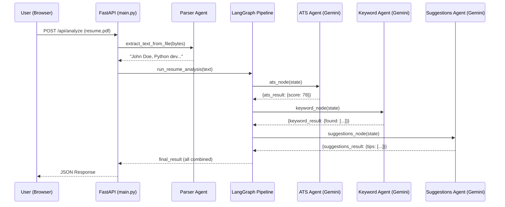
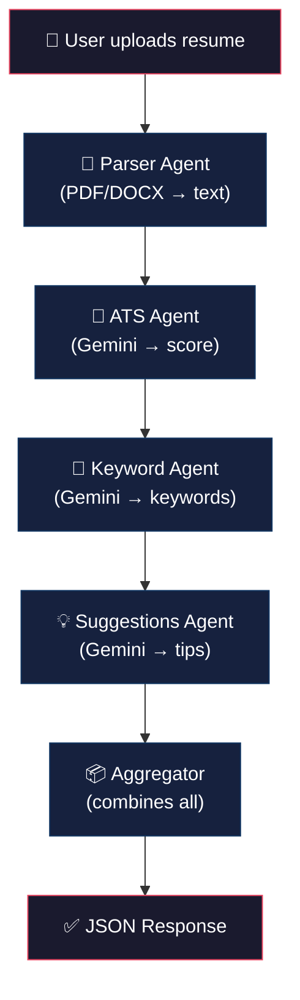
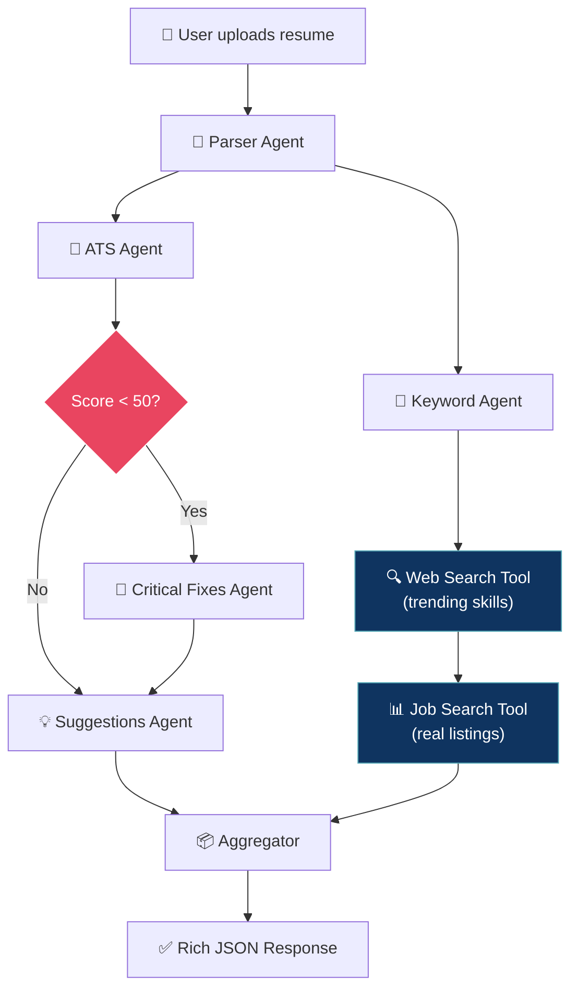

# 🧠 LangGraph Deep Dive — How Your ResumeAI Works & What's Next

This guide explains **everything** about the LangGraph architecture in your project, the alternatives, and how to supercharge it with **prebuilt tools & APIs**.

---

## Part 1: What is LangGraph? (The Big Picture)

### 🍕 The Pizza Factory Analogy

Imagine you're running a pizza factory:

| Factory Concept | LangGraph Concept | Your Project |
|---|---|---|
| The **recipe card** that travels with each pizza | **State** (`ResumeState`) | The resume text + all analysis results |
| Each **station** (dough, sauce, toppings, oven) | **Node** (a Python function) | `ats_node`, `keyword_node`, `suggestions_node` |
| The **conveyor belt** connecting stations | **Edge** (`add_edge()`) | `ats → keyword → suggestions → aggregator` |
| The **factory blueprint** showing all stations + belts | **Graph** (`StateGraph`) | [resume_graph.py](file:///c:/Users/91960/Desktop/files/Rishu_Project/backend/graph/resume_graph.py) |
| The **factory manager** who starts the line | **`graph.invoke()`** | Called from [analyze.py](file:///c:/Users/91960/Desktop/files/Rishu_Project/backend/routes/analyze.py) |

> [!IMPORTANT]
> LangGraph is NOT an AI model. It's a **workflow orchestrator** — it decides **which AI agent runs when**, and **what data flows where**.

---

## Part 2: The 4 Core Concepts (with YOUR code)

### 📦 Concept 1: STATE — The Shared Notepad

```
Every node reads from it, does work, and writes back to it.
```

In your project, the state is defined in [resume_graph.py](file:///c:/Users/91960/Desktop/files/Rishu_Project/backend/graph/resume_graph.py#L69-L79):

```python
class ResumeState(TypedDict):
    resume_text: str                    # INPUT: raw text from resume
    ats_result:         Optional[dict]  # Filled by ats_node
    keyword_result:     Optional[dict]  # Filled by keyword_node
    suggestions_result: Optional[dict]  # Filled by suggestions_node
    final_result:       Optional[dict]  # Filled by aggregator_node
```

**Think of it like a form being passed around an office:**
```
┌─────────────────────────────────────────────────┐
│              RESUME ANALYSIS FORM                │
│                                                  │
│  resume_text:    "John Doe, Python dev..."  ✅   │
│  ats_result:     { score: 78 }              ✅   │  ← ATS agent filled this
│  keyword_result: { found: ["Python"...] }   ✅   │  ← Keyword agent filled this
│  suggestions:    { tips: [...] }            ✅   │  ← Suggestions agent filled this
│  final_result:   { everything combined }    ✅   │  ← Aggregator combined all
└─────────────────────────────────────────────────┘
```

### 🔲 Concept 2: NODE — One Agent, One Job

Each node is just a regular Python function. It receives the state, does its work, and returns **only the keys it changed**.

From [resume_graph.py](file:///c:/Users/91960/Desktop/files/Rishu_Project/backend/graph/resume_graph.py#L91-L99):

```python
def ats_node(state: ResumeState) -> dict:
    result = run_ats_agent(state["resume_text"])  # Call the AI agent
    return {"ats_result": result}                 # Only update THIS key
```

> [!NOTE]
> The node function returns a **partial dict**, not the full state. LangGraph automatically merges it into the existing state. So if you return `{"ats_result": result}`, only `ats_result` gets updated — everything else stays the same.

### ➡️ Concept 3: EDGE — The Wiring

Edges define **which node runs after which**:

```python
builder.set_entry_point("ats_node")              # START → ats_node
builder.add_edge("ats_node",         "keyword_node")
builder.add_edge("keyword_node",     "suggestions_node")
builder.add_edge("suggestions_node", "aggregator_node")
builder.add_edge("aggregator_node",  END)         # aggregator → STOP
```

This creates a **linear pipeline**:
```
START → [ATS] → [Keywords] → [Suggestions] → [Aggregator] → END
```

### 🏗️ Concept 4: GRAPH — Putting It All Together

From [resume_graph.py](file:///c:/Users/91960/Desktop/files/Rishu_Project/backend/graph/resume_graph.py#L148-L175):

```python
def build_resume_graph():
    builder = StateGraph(ResumeState)       # 1. Create builder with state schema
    
    builder.add_node("ats_node", ats_node)  # 2. Add all nodes
    builder.add_node("keyword_node", keyword_node)
    # ... etc
    
    builder.set_entry_point("ats_node")     # 3. Set starting point
    builder.add_edge("ats_node", "keyword_node")  # 4. Connect them
    # ... etc
    
    graph = builder.compile()               # 5. Compile (validate + prepare)
    return graph
```

Then to run it:
```python
result = graph.invoke({"resume_text": "John Doe...", ...})
```

---

## Part 3: The Complete Flow (Request to Response)

Here's what happens when a user uploads a resume:



### File-by-File Breakdown

| Step | File | What Happens |
|------|------|-------------|
| 1 | [main.py](file:///c:/Users/91960/Desktop/files/Rishu_Project/backend/main.py) | FastAPI receives the upload, routes to `/api/analyze` |
| 2 | [analyze.py](file:///c:/Users/91960/Desktop/files/Rishu_Project/backend/routes/analyze.py#L50-L80) | Validates file → extracts text → calls LangGraph |
| 3 | [parser_agent.py](file:///c:/Users/91960/Desktop/files/Rishu_Project/backend/agents/parser_agent.py) | Reads PDF/DOCX bytes → returns plain text |
| 4 | [resume_graph.py](file:///c:/Users/91960/Desktop/files/Rishu_Project/backend/graph/resume_graph.py) | Orchestrates: ATS → Keywords → Suggestions → Aggregator |
| 5 | [ats_agent.py](file:///c:/Users/91960/Desktop/files/Rishu_Project/backend/agents/ats_agent.py) | Sends resume to Gemini → gets ATS score |
| 6 | [keyword_agent.py](file:///c:/Users/91960/Desktop/files/Rishu_Project/backend/agents/keyword_agent.py) | Sends resume to Gemini → gets keywords |
| 7 | [suggestions_agent.py](file:///c:/Users/91960/Desktop/files/Rishu_Project/backend/agents/suggestions_agent.py) | Uses resume + ATS score → gets improvement tips |

---

## Part 4: What Your Agents Actually Do vs. What They COULD Do

Right now, your agents are **"prompt-only" agents** — they just send a prompt to Gemini and get text back. They don't use **tools**.

```
Current Architecture:
  ┌──────────────┐     prompt      ┌──────────────┐
  │  Your Agent  │ ─────────────→  │   Gemini AI  │
  │  (Python fn) │ ←─────────────  │   (LLM)      │
  └──────────────┘     response    └──────────────┘
  
  ⚠️ The AI can only "think" — it can't "do" anything in the real world
```

**What you COULD have:**

```
Enhanced Architecture with Tools:
  ┌──────────────┐     prompt      ┌──────────────┐
  │  Your Agent  │ ─────────────→  │   Gemini AI  │
  │  (Python fn) │ ←─────────────  │   (LLM)      │
  └──────────────┘    "call tool"  └──────┬───────┘
                                          │
                    ┌─────────────────────┼─────────────────────┐
                    ▼                     ▼                     ▼
              ┌──────────┐        ┌──────────────┐      ┌────────────┐
              │ Search   │        │ LinkedIn     │      │ Job Board  │
              │ Google   │        │ Scraper      │      │ API        │
              └──────────┘        └──────────────┘      └────────────┘
```

---

## Part 5: 🛠️ Prebuilt Tools You Can Use RIGHT NOW

### Category A: LangChain Community Tools (Plug & Play)

These are **ready-made tools** from `langchain-community` that you can import and use:

#### 1. 🔍 Tavily Search — Web Search for AI
```python
# pip install tavily-python langchain-community
from langchain_community.tools.tavily_search import TavilySearchResults

search_tool = TavilySearchResults(max_results=5)

# Now the agent can search the web!
results = search_tool.invoke("top skills for software engineer 2025")
```
**Use in your project:** Let the keyword agent search for "most in-demand skills for {detected_role}" and compare with the resume.

#### 2. 🌐 DuckDuckGo Search — Free, No API Key
```python
# pip install duckduckgo-search langchain-community
from langchain_community.tools import DuckDuckGoSearchResults

search = DuckDuckGoSearchResults()
results = search.invoke("average salary for Python developer India")
```
**Use in your project:** Add a salary estimator feature — detect the role from resume, search current salary data.

#### 3. 📄 Document Loaders — Read Any File
```python
from langchain_community.document_loaders import PyPDFLoader, Docx2txtLoader

# Already handled by your parser_agent, but these are alternatives
loader = PyPDFLoader("resume.pdf")
pages = loader.load()
```

#### 4. 🧮 Wikipedia — Knowledge Lookup
```python
# pip install wikipedia langchain-community
from langchain_community.tools import WikipediaQueryRun
from langchain_community.utilities import WikipediaAPIWrapper

wiki = WikipediaQueryRun(api_wrapper=WikipediaAPIWrapper())
result = wiki.invoke("Applicant Tracking System")
```

#### 5. 🐍 Python REPL — Let AI Run Python Code
```python
from langchain_community.tools import PythonREPLTool

python_tool = PythonREPLTool()
# The AI can now write and execute Python code!
```

### Category B: External APIs You Can Wrap as Tools

#### 6. 📊 JSearch API (RapidAPI) — Real Job Listings
```python
import requests
from langchain.tools import tool

@tool
def search_jobs(query: str) -> str:
    """Search for real job listings. Input should be a job title like 'Python Developer'."""
    url = "https://jsearch.p.rapidapi.com/search"
    headers = {
        "X-RapidAPI-Key": "your-key",
        "X-RapidAPI-Host": "jsearch.p.rapidapi.com"
    }
    params = {"query": query, "num_pages": 1}
    response = requests.get(url, headers=headers, params=params)
    jobs = response.json().get("data", [])[:5]
    return str([{"title": j["job_title"], "company": j["employer_name"]} for j in jobs])
```
**Use in your project:** After detecting the role from resume, show REAL matching jobs.

#### 7. 📧 SendGrid / Mailgun — Email the Results
```python
@tool
def email_results(email: str, report: str) -> str:
    """Send the resume analysis report to the user's email."""
    # Use SendGrid API to send email
    ...
```

#### 8. 🔗 LinkedIn Profile Scraper (ProxyCurl API)
```python
@tool  
def get_linkedin_profile(linkedin_url: str) -> str:
    """Fetch a LinkedIn profile to compare with resume."""
    headers = {"Authorization": "Bearer YOUR_KEY"}
    response = requests.get(
        "https://nubela.co/proxycurl/api/v2/linkedin",
        params={"url": linkedin_url},
        headers=headers
    )
    return str(response.json())
```

---

## Part 6: HOW to Add Prebuilt Tools to Your LangGraph

There are **two approaches** — here's which one fits where:

### Approach A: Tool inside a Node (Simple — What I Recommend)

The tool is called **by your Python code** inside a LangGraph node. The LLM doesn't "decide" to call it — your code does.

```python
# In your keyword_agent.py — enhanced with web search
from langchain_community.tools import DuckDuckGoSearchResults

search = DuckDuckGoSearchResults()

def run_keyword_agent(resume_text: str) -> dict:
    # Step 1: LLM detects role and keywords (existing code)
    response = llm.invoke([HumanMessage(content=prompt)])
    result = _parse_json_response(response.content)
    
    # Step 2: NEW — Search for trending skills for that role
    detected_role = result.get("detected_role", "Software Engineer")
    trending = search.invoke(f"most in-demand skills for {detected_role} 2025")
    
    # Step 3: Add trending skills to the response
    result["trending_skills"] = trending
    return result
```

### Approach B: LLM-Driven Tool Calling (Advanced — Agent with Autonomy)

The LLM **decides on its own** which tools to call. This is more powerful but less predictable.

```python
from langchain_google_genai import ChatGoogleGenerativeAI
from langchain.tools import tool
from langchain_community.tools import DuckDuckGoSearchResults

# Define tools
@tool
def analyze_ats(resume_text: str) -> str:
    """Analyze ATS compatibility of a resume."""
    # ... your logic

search_tool = DuckDuckGoSearchResults()

# Give tools to the LLM
llm = ChatGoogleGenerativeAI(model="gemini-1.5-flash")
llm_with_tools = llm.bind_tools([analyze_ats, search_tool])

# Now the LLM can DECIDE to call any tool
response = llm_with_tools.invoke("Analyze this resume and find relevant jobs: ...")
```

> [!TIP]
> **For your project, start with Approach A.** It's simpler, more predictable, and easier to debug. Use Approach B when you want the AI to make decisions about what to do.

---

## Part 7: What Are the Alternatives to LangGraph?

| Framework | What It Is | When to Use It | Complexity |
|-----------|-----------|---------------|------------|
| **LangGraph** ✅ (yours) | Graph-based multi-agent orchestrator | Multiple specialized agents with clear flow | ⭐⭐⭐ Medium |
| **AgentExecutor** | Single agent loop (old LangChain way) | Simple single-agent tasks | ⭐ Easy |
| **CrewAI** | Multi-agent with "roles" (Manager, Researcher, Writer) | Team-like collaboration between agents | ⭐⭐ Easy-Medium |
| **AutoGen** (Microsoft) | Multi-agent conversations | Agents that chat with each other | ⭐⭐⭐ Medium |
| **LlamaIndex** | Data-focused (RAG, querying documents) | When you need to search/query large docs | ⭐⭐ Easy-Medium |
| **Plain Python** | Just call APIs directly, no framework | Very simple, single-purpose tools | ⭐ Easiest |

### Quick Comparison:

```
Your project WITHOUT LangGraph (plain Python):
──────────────────────────────────────────────
result1 = call_ats_agent(text)        # Just function calls
result2 = call_keyword_agent(text)    # No state management
result3 = call_suggestions_agent(text, result1)
final = combine(result1, result2, result3)

❌ No state management
❌ No conditional branching  
❌ Hard to add/remove agents
❌ No visualization or debugging tools
```

```
Your project WITH LangGraph (what you have):
──────────────────────────────────────────────
graph = build_resume_graph()
result = graph.invoke({"resume_text": text})

✅ Clean state management
✅ Can add conditional edges ("if score < 50, run improvement agent")
✅ Easy to add/remove nodes
✅ Built-in visualization, streaming, checkpointing
✅ Production-ready (used by companies at scale)
```

```
Your project with CrewAI (alternative):
──────────────────────────────────────────────
from crewai import Agent, Task, Crew

ats_agent = Agent(role="ATS Scorer", goal="Score resumes", llm=gemini)
keyword_agent = Agent(role="Keyword Analyst", goal="Extract skills", llm=gemini)

crew = Crew(agents=[ats_agent, keyword_agent], tasks=[...])
result = crew.kickoff()

✅ Very intuitive "team" metaphor
✅ Agents can delegate to each other
❌ Less control over exact flow
❌ Newer, smaller community
```

---

## Part 8: 🚀 Powerful Features You're NOT Using Yet

### Feature 1: Conditional Edges (Branching)

Right now your graph is linear. But LangGraph can **branch**:

```python
def should_improve(state: ResumeState) -> str:
    """If ATS score is low, run an extra improvement agent."""
    score = state.get("ats_result", {}).get("overall_score", 0)
    if score < 50:
        return "improvement_node"   # Go to improvement agent
    else:
        return "keyword_node"       # Skip to keywords

# Instead of a simple edge:
builder.add_conditional_edges(
    "ats_node",
    should_improve,
    {
        "improvement_node": "improvement_node",
        "keyword_node": "keyword_node"
    }
)
```

This would give you:
```
                        ┌─── score < 50 ──→ [Improvement Agent] ──┐
START → [ATS Agent] ────┤                                          ├──→ [Keywords] → ...
                        └─── score >= 50 ─────────────────────────┘
```

### Feature 2: Parallel Execution

Your ATS and Keyword agents don't depend on each other — they could run **simultaneously**:

```python
# Instead of sequential:
builder.add_edge("ats_node", "keyword_node")

# Run in parallel by having both start from the same point:
builder.set_entry_point("ats_node")
builder.set_entry_point("keyword_node")  # Both start at once!
builder.add_edge("ats_node", "aggregator_node")
builder.add_edge("keyword_node", "aggregator_node")
```

### Feature 3: Streaming (Real-time Updates)

Instead of waiting for ALL agents to finish, stream results as they come:

```python
# Instead of graph.invoke() — use graph.stream()
for event in graph.stream(initial_state):
    print(event)  # Shows each node's output as it completes
    # You can send this to the frontend via WebSocket!
```

### Feature 4: Checkpointing (Memory)

LangGraph can save state and resume later:

```python
from langgraph.checkpoint.memory import MemorySaver

memory = MemorySaver()
graph = builder.compile(checkpointer=memory)

# Now the graph remembers previous runs!
result = graph.invoke(state, config={"configurable": {"thread_id": "user-123"}})
```

---

## Part 9: 🎯 Concrete Enhancements for YOUR Project

Here's a prioritized list of what you could add:

### 🟢 Easy Wins (1-2 hours each)

| Enhancement | What It Does | Tool/Library |
|---|---|---|
| **Web search for trending skills** | After detecting role, search what skills are trending | `DuckDuckGoSearchResults` (free) |
| **Conditional improvement tips** | If ATS score < 50, run an extra "critical fixes" agent | LangGraph conditional edges |
| **Salary estimation** | Search avg salary for detected role + location | `DuckDuckGoSearchResults` or Tavily |

### 🟡 Medium Effort (half day each)

| Enhancement | What It Does | Tool/Library |
|---|---|---|
| **Real job matching** | Show actual job listings matching the resume | JSearch API (RapidAPI) |
| **LinkedIn profile import** | Let user paste LinkedIn URL, fetch profile data | ProxyCurl API |
| **Streaming results** | Show each agent's results as they complete | LangGraph `.stream()` + WebSocket |

### 🔴 Advanced (1-2 days each)

| Enhancement | What It Does | Tool/Library |
|---|---|---|
| **RAG over job descriptions** | Upload multiple JDs, find best match using embeddings | LangChain + FAISS/ChromaDB |
| **Resume rewriter agent** | AI rewrites weak sections of the resume | LangGraph + new node |
| **Multi-model routing** | Use GPT-4 for creative tasks, Gemini for analysis | LangChain model routing |

---

## Part 10: 🗺️ Architecture Diagram — Current vs. Enhanced

### Current Architecture


### Enhanced Architecture (what you COULD build)


---

## Quick Reference Card

```
┌─────────────────────────────────────────────────────────────────┐
│                    LANGGRAPH CHEAT SHEET                         │
├─────────────────────────────────────────────────────────────────┤
│                                                                  │
│  IMPORT:                                                         │
│    from langgraph.graph import StateGraph, END                   │
│                                                                  │
│  STATE:                                                          │
│    class MyState(TypedDict):                                     │
│        input_data: str                                           │
│        result: Optional[dict]                                    │
│                                                                  │
│  NODE:                                                           │
│    def my_node(state: MyState) -> dict:                          │
│        return {"result": do_work(state["input_data"])}           │
│                                                                  │
│  BUILD:                                                          │
│    builder = StateGraph(MyState)                                 │
│    builder.add_node("my_node", my_node)                          │
│    builder.set_entry_point("my_node")                            │
│    builder.add_edge("my_node", END)                              │
│    graph = builder.compile()                                     │
│                                                                  │
│  RUN:                                                            │
│    result = graph.invoke({"input_data": "hello", "result": None})│
│                                                                  │
│  CONDITIONAL:                                                    │
│    builder.add_conditional_edges("node_a", router_fn, {          │
│        "path1": "node_b",                                        │
│        "path2": "node_c"                                         │
│    })                                                            │
│                                                                  │
│  STREAM:                                                         │
│    for event in graph.stream(initial_state):                     │
│        print(event)                                              │
│                                                                  │
│  TOOLS:                                                          │
│    pip install langchain-community                               │
│    from langchain_community.tools import DuckDuckGoSearchResults │
│    search = DuckDuckGoSearchResults()                            │
│    result = search.invoke("query")                               │
│                                                                  │
└─────────────────────────────────────────────────────────────────┘
```

> [!TIP]
> **Your next step:** Pick ONE enhancement from the "Easy Wins" table above and tell me — I'll implement it in your project with full code!
